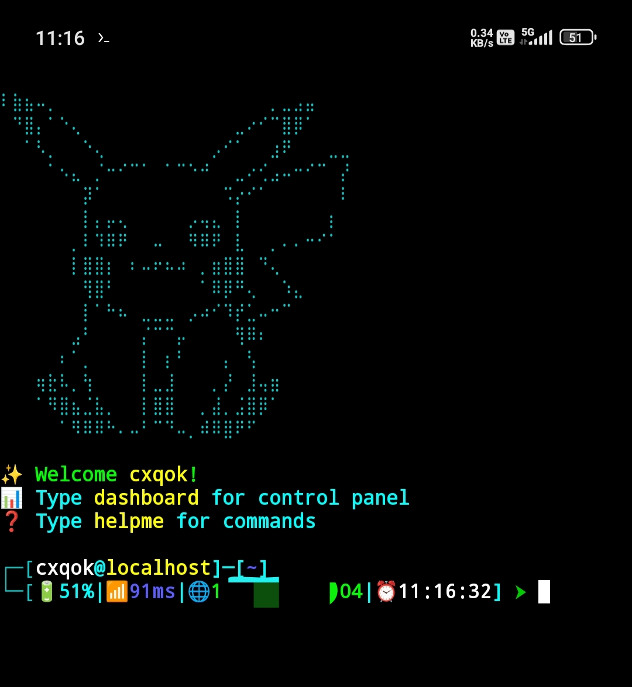

# 🔥 Termux-Pro

## 🚀 Installation
 ONE LINE COMMAND -🎯
 just copy paste this link in your termux.

```
pkg update -y && pkg install git -y && git clone https://github.com/cxqok-x/termux-pro.git && cd termux-pro && chmod +x termux-pro.sh && bash termux-pro.sh
```

<p align="center">
  
</p>

Main Look 🧩


TOTAL 8 ASCII ART H
 YOU CAN CHANGE THEM LATER THROUGH DASHBOARD.

ALSO 7 DIFFERENT COLOURS FOR ASCII ARTS.

15 DIFFERENT COLOURS FOR ELEMENTS.

 YOU CAN CHANGE EVERY ELEMENTS COLOURS.


*IF TERMINAL STUCK PRESS- Ctrl+x 

*** FOR UNINSTALL TERMUX-PRO ***
 type>    uninstall-pro
 and close your termux or type exit.

******type "helpme" for all commands*****
******type "dashboard" for customisation*****
